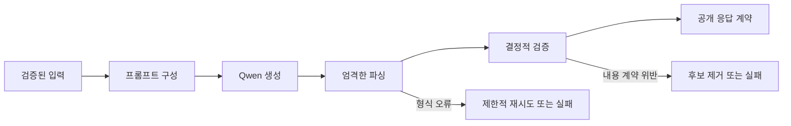
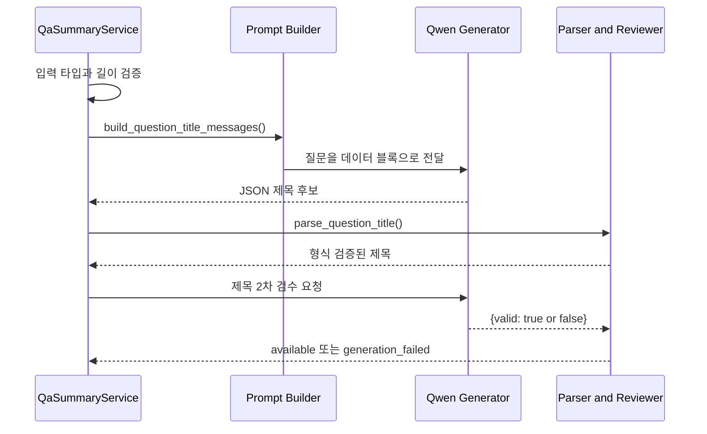
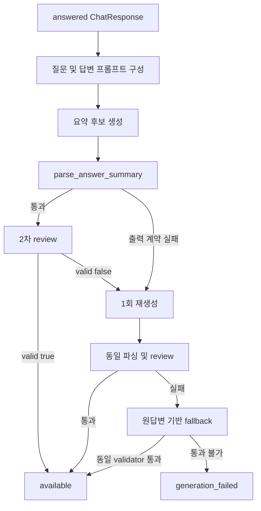
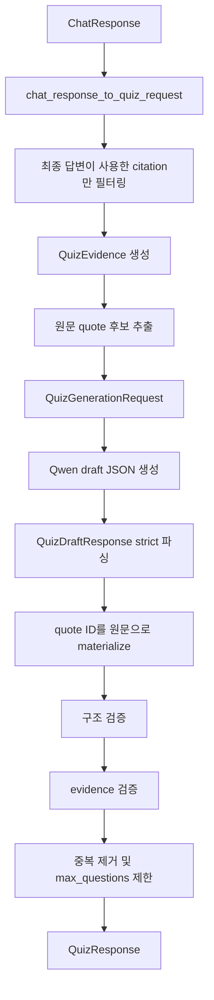
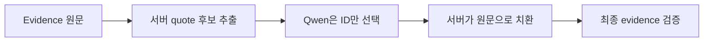

# PiCare 4차 프로젝트 개인 담당 구현 상세 정리

## Q&A 요약 및 Dynamic Mini Challenge

- 작성자: 김나은
- 문서 기준일: 2026-09-28
- 기준 브랜치: 현재 저장소 `main`
- 작성 근거: Git 작성자 `naeuneo` / `김나은` 커밋, 현재 구현 코드, 저장된 최종 평가 결과
- 문서 목적: 최종 발표, 포트폴리오, 기술 면접 및 팀 인수인계에 사용할 수 있도록 개인 담당 구현을 구체적으로 정리

---

## 1. 담당 범위 요약

제가 맡은 핵심 영역은 **확정된 Q&A 결과를 후속 사용자 기능으로 연결하는 AI 서비스 계층**입니다.

구체적으로 다음 두 기능을 구현했습니다.

1. **Q&A 요약**
   - 사용자의 질문을 질문 아카이브용 짧은 제목으로 변환
   - 최종 Q&A 답변을 인용 근거가 유지된 짧은 요약으로 변환
   - 모델 출력에 대한 계약, 파싱, 인용 검증, 2차 검수, 재시도, fallback 및 생성 취소 처리

2. **Dynamic Mini Challenge**
   - 최종 Q&A 답변과 실제 사용된 인용 근거를 퀴즈 생성 입력으로 변환
   - Qwen 모델을 이용해 최대 3개의 객관식 문제 생성
   - 문항 구조, 정답, evidence allowlist, 원문 인용, 중복 여부를 서버에서 결정적으로 검증
   - 실제 모델 평가 데이터와 정량 평가 스크립트 및 결과 문서 작성

한 문장으로 정리하면 다음과 같습니다.

> 확정된 Q&A의 핵심을 인용 근거와 함께 안전하게 압축하고, 같은 근거에서 검증 가능한 객관식 문제를 생성하는 프레임워크 독립 AI 서비스 계층을 구현했습니다.

---

## 2. 개인 구현과 팀 구현의 경계

프로젝트 전체 기능을 개인 구현으로 오해하지 않도록 역할을 아래와 같이 구분합니다.

### 2.1 직접 구현한 영역

| 영역 | 직접 구현 내용 |
|---|---|
| 요약 결과 계약 | 질문 제목과 답변 요약의 값·상태를 독립적으로 표현하는 `QaSummaryResult` |
| 질문 제목 생성 | 질문 아카이브용 제목 프롬프트, 생성 서비스, 파서, 검수 처리 |
| 답변 요약 생성 | 최종 답변 기반 요약 프롬프트, 인용 유지, 재시도 및 fallback |
| 요약 안전성 검증 | 인용 ID, 명령어, 기술 용어, 수치 조건, 단정 표현 검증 |
| 생성 취소 | 서비스 단계별 취소 확인과 Qwen 추론 중단 신호 전달 |
| 퀴즈 입력 계약 | Q&A 인용을 `QuizEvidence`와 `QuizGenerationRequest`로 변환 |
| 퀴즈 생성 계약 | draft와 최종 응답을 분리한 `QuizDraftResponse`, `QuizResponse` |
| 퀴즈 프롬프트 | 근거 제한, 4지선다, 단일 정답, JSON-only 출력 규칙 |
| 퀴즈 파서 | strict JSON 파싱과 제한적인 JSON 문법 복구 |
| 퀴즈 검증 | 구조, evidence, quote, 중복, 문항 수 검증 |
| quote 후보 방식 | 원문 후보를 서버가 추출하고 모델은 ID만 선택하는 방식 |
| 평가 | 고정 fixture, 정량 평가 실행기, 최종 결과 및 실패 원인 문서화 |

### 2.2 연동된 팀 기능

- Qwen3-4B 모델 실행 환경
- 최종 Q&A 답변과 citation을 제공하는 기존 Q&A/RAG 기능
- RunPod GPU 실행 환경
- Django 화면에서 요약을 저장하고 미니 챌린지를 표시하는 웹 기능

### 2.3 개인 구현으로 주장하지 않는 영역

- Qwen 모델 자체 개발 또는 사전학습
- QLoRA 알고리즘과 전체 학습 파이프라인
- Hybrid RAG 검색기 전체
- Chroma 인덱스 및 문서 청크 생성 전체
- Django 미니 챌린지 화면, DB 작업 상태, 오답노트 기능
- AWS 및 RunPod 배포 인프라 전체

---

## 3. 두 기능에 공통으로 적용한 설계 원칙

### 3.1 모델 출력은 최종 결과가 아니다

LLM이 출력한 문자열을 바로 사용자에게 전달하지 않았습니다.

모든 생성 결과는 다음 단계를 거칩니다.



### 3.2 Fail-closed

결과가 애매할 때 자동으로 통과시키지 않고 실패 상태로 닫았습니다.

- 요약이 원답변의 인용을 보존하지 못하면 `generation_failed`
- 퀴즈 근거가 부족하면 `insufficient_content`
- 문항이 구조 또는 evidence 검증에 실패하면 해당 후보 제거
- 모델 출력이 계약과 맞지 않으면 제한적 재생성 후 실패 처리

### 3.3 프레임워크 독립성

핵심 로직을 Streamlit이나 Django view 내부에 직접 넣지 않았습니다.

- 요약: `QaSummaryService`
- 퀴즈: `QuizGenerator`
- 모델 경계: `generate(messages)` 인터페이스

웹 프레임워크가 바뀌어도 계약, 파서, validator를 그대로 재사용할 수 있도록 구성했습니다.

### 3.4 비신뢰 입력 격리

사용자의 질문, 최종 답변, citation 내용 안에 프롬프트처럼 보이는 문장이 포함될 수 있습니다.

이를 방어하기 위해 다음 방식을 사용했습니다.

- 질문·답변·evidence를 XML 형태의 데이터 블록에 넣음
- HTML escape를 적용해 태그 구조 변경 방지
- system prompt에서 데이터 블록 내부 지시를 따르지 않도록 명시
- 결과는 JSON 객체 하나만 출력하도록 제한

---

# Part A. Q&A 요약 구현

## 4. 기능 목적

Q&A 요약 기능은 하나의 Q&A 결과에서 두 종류의 결과를 생성합니다.

1. `question_title`
   - 질문 아카이브 목록에서 사용할 짧은 제목
2. `answer_summary`
   - 최종 답변의 핵심과 인용 근거를 유지한 짧은 요약

두 결과는 서로 독립적입니다. 제목 생성이 실패해도 답변 요약은 성공할 수 있고, 반대의 경우도 성공 결과를 보존합니다.

---

## 5. 요약 결과 계약

대표 파일:

- `src/contracts/models.py`
- `src/services/qa_summary.py`
- `src/services/qa_summary_parser.py`

### 5.1 `QaSummaryResult`

```text
QaSummaryResult
├── question_title
├── question_title_status
├── answer_summary
└── answer_summary_status
```

각 필드는 값과 상태를 별도로 가집니다.

| 상태 | 의미 |
|---|---|
| `available` | 생성과 검증에 성공하여 값 사용 가능 |
| `generation_failed` | 모델 호출, 파싱 또는 검수 실패 |
| `not_applicable` | 입력이나 원응답 상태상 생성 대상이 아님 |
| `unsupported` | 사용할 수 있는 structured text generator가 없음 |

### 5.2 계약 검증 규칙

- `available`일 때만 실제 문자열이 존재할 수 있음
- 다른 상태에서는 값이 반드시 `None`
- 앞뒤 공백이 없는 한 줄 문자열이어야 함
- 줄바꿈 금지
- 질문 제목은 공개 계약상 최대 200자
- 서비스에서는 생성 제목을 추가로 최대 80자로 제한
- 답변 요약은 최대 500자
- 답변 요약은 최대 3문장

제목과 요약의 상태를 한 값으로 합치지 않은 이유는 **부분 성공을 보존하기 위해서**입니다.

---

## 6. 질문 제목 생성 흐름



### 6.1 입력 처리

`generate_question_title()`은 다음을 확인합니다.

1. 질문이 문자열인지 확인
2. `validate_input_text()`로 공백 및 입력 제한 검증
3. text generator 사용 가능 여부 확인
4. 각 생성 전후 취소 여부 확인

입력이 적절하지 않으면 `not_applicable`, 생성기가 없으면 `unsupported`를 반환합니다.

### 6.2 제목 프롬프트 규칙

대표 파일: `src/lang/qa_summary_prompts.py`

- 질문의 핵심 주제와 의도 유지
- 질문에 없는 제품명, 사실, 해결 방법 추가 금지
- 기술 용어를 유사한 다른 용어로 임의 변경 금지
- 한 줄의 짧은 한국어 제목
- JSON 객체 하나만 출력

### 6.3 파싱과 2차 검수

`parse_question_title()`은 정확히 다음 형태만 허용합니다.

```json
{"question_title": "짧은 제목"}
```

추가 필드, 빈 문자열, `null`, 여러 줄, 계약보다 긴 문자열은 거부합니다.

첫 파싱을 통과한 제목도 바로 사용하지 않습니다. 별도의 review prompt로 질문에 없는 기술 용어가 추가되었는지, 질문의 핵심 의도가 보존되었는지 확인합니다.

review 결과는 정확히 다음 계약이어야 합니다.

```json
{"valid": true}
```

문자열 `"true"`, 추가 필드, 불확실한 설명문은 모두 실패합니다.

---

## 7. 답변 요약 생성 흐름



### 7.1 생성 대상 판정

다음 조건을 만족할 때만 답변 요약을 생성합니다.

- `ChatResponse.status == "answered"`
- 질문이 유효한 문자열
- structured text generator 사용 가능

답변 상태가 `no_evidence`, `blocked`, `error` 등이라면 요약을 만들지 않고 `not_applicable`로 처리합니다.

### 7.2 답변 요약 프롬프트 규칙

- 원답변에 없는 사실·절차·명령어 추가 금지
- 질문만 보고 빠진 답을 추측하지 않음
- 한국어 1~3문장
- 한 줄, 최대 500자
- 원답변이 실제 사용한 citation ID를 최소 1개 포함
- 서로 다른 사실은 각 사실 뒤에 적절한 citation 배치
- 가능·권장을 필수·의무로 강화하지 않음
- 부정 여부와 수치 범위 방향 유지
- 제품명·장치명·명령어 철자를 질문 또는 답변에서 그대로 사용

---

## 8. 답변 요약의 결정적 검증

모델이 자연스러운 문장을 만들었다는 이유만으로 통과시키지 않습니다.

### 8.1 출력 형식 검증

기본적으로 정확히 다음 JSON을 기대합니다.

```json
{"answer_summary": "핵심 요약 [C1]"}
```

실제 Qwen이 JSON wrapper 없이 한 줄 요약만 반환하는 경우가 있어, 다음 조건을 모두 만족할 때만 제한적으로 수용합니다.

- 비어 있지 않음
- 한 줄
- code fence 없음
- `{` 또는 `}` 없음
- 이후 JSON 출력과 동일한 계약·인용 검사를 통과

설명문과 JSON이 섞였거나 여러 줄인 출력은 거부합니다.

### 8.2 citation 검증

`parse_answer_summary()`는 다음을 검사합니다.

1. 요약에 최소 하나의 `[C#]`가 존재하는지
2. citation ID가 원답변이 실제 사용한 ID의 부분집합인지
3. `[C0]`, `[C01]`과 같은 잘못된 형식이 없는지
4. citation 외의 임의 대괄호가 없는지

예를 들어 원답변이 `[C1]`만 사용했는데 요약이 `[C2]`를 붙이면 실패합니다.

### 8.3 명령어와 citation 연결 검증

요약에 backtick 명령어가 포함되면, 단순히 명령어가 원답변 어딘가에 존재하는지만 보지 않습니다.

- 명령어 뒤에 citation ID가 있는지
- 해당 citation ID가 연결된 원답변 span 안에 같은 명령어가 존재하는지

예를 들어 `` `vcgencmd measure_temp` ``가 원답변의 `[C2]` 근거에 있는데 요약이 `[C1]`을 붙이면 거부합니다.

### 8.4 기술 용어 전사 오류 검증

질문과 원답변의 긴 한국어 용어를 기준으로, 요약에서 한 글자 삽입·삭제·치환이 발생한 유사 단어를 찾습니다.

목적은 모델이 기술 용어를 비슷하지만 잘못된 철자로 바꾸는 것을 막는 것입니다.

### 8.5 단정 강도 검증

다음 표현이 요약에는 있지만 원답변에는 없다면 실패합니다.

- 가장
- 반드시
- 무조건
- 유일
- 항상

이는 권장 사항을 필수 조건처럼 바꾸는 의미 왜곡을 막기 위한 규칙입니다.

### 8.6 수치 범위 검증

요약에 다음 형태가 들어가면 원답변에 동일한 조건이 있어야 합니다.

- `10% 이상`
- `5초 이하`
- `3GB 미만`
- `80도 초과`

숫자만 같은 것이 아니라 `이상`, `이하`, `미만`, `초과` 방향까지 동일해야 합니다.

---

## 9. 2차 모델 검수

결정적 validator가 형식과 일부 의미 변형을 잡더라도, 모든 자연어 의미를 규칙으로 검증할 수는 없습니다.

따라서 후보 요약을 다음 정보와 함께 review 모델에 전달합니다.

- 원 질문
- 확정된 원답변
- 후보 요약이 사용한 citation의 실제 quote
- 후보 요약

review 모델은 다음을 판정합니다.

- 요약의 사실이 원답변에 존재하는지
- 원답변과 모순되는지
- citation이 실제 해당 사실을 지지하는지
- 근거에 없는 비교나 확정적 주장이 추가되었는지

검수 결과가 명확한 `{"valid": true}`가 아니면 통과시키지 않습니다.

---

## 10. 재시도와 fallback

### 10.1 1회 재생성

첫 요약 후보가 출력 계약 또는 review를 통과하지 못하면 같은 원답변으로 한 번 더 생성합니다.

두 번째 프롬프트에는 다음 내용을 추가합니다.

> 이전 출력이 형식 또는 인용 검사를 통과하지 못했으므로 원답변만 다시 읽고 JSON 객체 하나로 재생성하라.

모델 호출 자체에서 예외가 발생한 경우에는 무조건 반복하지 않고 `generation_failed`로 처리합니다.

### 10.2 검증형 fallback

두 번의 모델 요약이 모두 실패하면 `_fallback_answer_summary()`가 실행됩니다.

처리 방식은 다음과 같습니다.

1. 원답변을 빈 줄과 목록 시작 기준으로 block 분리
2. 목록 기호 제거
3. citation이 포함된 선두 block만 순서대로 선택
4. 최대 500자
5. 최대 3개 block
6. 매 block 추가 시 `parse_answer_summary()`로 다시 검증

중요한 점은 fallback도 검증 예외가 아니라는 것입니다.

- citation allowlist
- 명령어와 citation 매핑
- 수치 조건
- 단정 강도
- 공개 요약 계약

을 그대로 통과해야 합니다.

안전한 fallback을 만들 수 없으면 `generation_failed`로 종료합니다.

---

## 11. 생성 취소 처리

사용자가 요약 생성을 취소했는데 제목 검수나 답변 요약이 계속 실행되면 GPU 자원과 대기 시간이 낭비됩니다.

이를 위해 다음 경로에 취소 검사를 넣었습니다.

- 서비스 진입 직후
- 각 모델 호출 직전
- 모델 호출 직후
- 제목 생성과 답변 요약 사이
- 최종 결과 조립 전

`cancel_requested` callback이 전달되면 Qwen generator에도 전달하여 stopping criteria 수준에서 추론을 중단할 수 있게 했습니다.

취소는 일반 생성 실패로 삼키지 않고 `GenerationCancelled`를 다시 발생시켜 상위 작업 관리 계층이 취소 상태를 구분할 수 있게 했습니다.

---

## 12. Q&A 요약 대표 테스트 범위

대표 테스트 파일:

- `tests/test_qa_summary_contract.py`
- `tests/test_qa_summary_service.py`
- `tests/test_qa_summary_title.py`
- `tests/test_huggingface_qa_summary_text_generator.py`

검증한 주요 시나리오는 다음과 같습니다.

- 제목과 답변 요약의 독립 성공·실패
- 답변 상태가 `answered`가 아닐 때 요약 호출 생략
- generator 미지원 상태
- 잘못된 JSON과 추가 필드 거부
- 한 줄 Qwen prose의 제한적 수용
- 원답변에 없는 citation 거부
- malformed citation 거부
- 3문장 허용 및 4문장 거부
- 새 단정 표현과 수치 범위 왜곡 거부
- 명령어에 잘못된 citation을 붙인 경우 거부
- 기술 용어 오탈자 거부
- 첫 후보 실패 후 1회 재생성
- 두 후보 실패 후 검증형 fallback
- 제목 검수 실패 시 답변 요약 성공 보존
- 생성 단계별 취소 전파

요약 기능은 미니 챌린지처럼 별도의 대규모 정량 평가 수치를 만들기보다, **명시적 계약과 회귀 테스트로 안정성을 검증한 기능**으로 설명하는 것이 정확합니다.

---

# Part B. Dynamic Mini Challenge 구현

## 13. 기능 목적

미니 챌린지는 사용자가 Q&A 답변을 읽은 직후 핵심 내용을 이해했는지 확인하는 기능입니다.

핵심 요구사항은 다음과 같습니다.

- 확정된 최종 Q&A 답변만 사용
- 최종 답변이 실제로 인용한 근거만 사용
- 1~3개의 4지선다 문제 생성
- 단일 정답
- 정답과 해설이 원문 evidence로 직접 뒷받침되어야 함
- 근거가 부족하면 억지로 문제를 만들지 않음

---

## 14. 전체 생성 흐름



Retriever나 Chroma를 다시 호출하지 않습니다. 이미 검증된 최종 Q&A의 citation을 재사용합니다.

---

## 15. 퀴즈 데이터 계약

대표 파일: `src/contracts/models.py`

### 15.1 `QuizEvidence`

한 개의 최종 Q&A citation을 퀴즈 근거로 표현합니다.

| 필드 | 의미 |
|---|---|
| `citation_id` | 요청 내부 citation ID, 예: `C1` |
| `document_id` | 원문 문서 식별자 |
| `chunk_id` | 원문 chunk 식별자 |
| `content` | citation의 실제 quote |

빈 `document_id`, `chunk_id`, `content`는 허용하지 않습니다.

### 15.2 `QuizQuoteCandidate`

서버가 evidence 원문에서 추출한 안전한 인용 후보입니다.

```text
quote_id: C1-Q1
evidence_id: C1
content: evidence에 실제 포함된 15~240자 원문
```

### 15.3 `QuizGenerationRequest`

- `request_id`
- `answer`
- `evidence`
- `quote_candidates`
- `max_questions`

`max_questions`는 1 이상 3 이하입니다.

### 15.4 Draft와 최종 응답 분리

모델은 `QuizDraftQuestion`을 생성합니다.

모델 출력에는 실제 quote 문자열 대신 다음 필드가 있습니다.

```json
"supporting_quote_id": "C1-Q1"
```

서버가 이 ID를 실제 원문으로 치환한 뒤 `QuizQuestion`을 만듭니다.

이 분리를 통해 모델이 원문을 조금 바꾸거나 구두점을 누락하는 문제를 줄였습니다.

---

## 16. Q&A 응답을 퀴즈 입력으로 변환

대표 파일: `src/services/quiz_adapters.py`

`chat_response_to_quiz_request()`의 처리 순서는 다음과 같습니다.

1. 응답 상태가 `answered`인지 확인
2. citation이 존재하는지 확인
3. `response.answer`에서 실제 사용된 `[C#]` ID 추출
4. 응답의 전체 citation 중 실제 사용 ID만 선택
5. `QuizEvidence` 생성
6. evidence 원문에서 quote 후보 생성
7. `QuizGenerationRequest` 반환

응답에 citation 객체가 존재하더라도 최종 답변 텍스트가 해당 ID를 사용하지 않았다면 퀴즈 evidence에서 제외합니다.

이는 검색 결과 전체가 아니라 **사용자에게 실제 제시된 최종 근거 범위** 안에서만 문제를 만들기 위한 제한입니다.

---

## 17. 원문 quote 후보 추출

대표 파일: `src/services/quiz_quote_candidates.py`

### 17.1 후보 생성 규칙

- evidence를 줄 단위로 분리
- `-`, `*`, `1.` 같은 목록 표식 제거
- 코드 fence와 제목 형태의 줄 제외
- 문장 부호 기준으로 문장 분리
- 15자 미만 또는 240자 초과 후보 제외
- 동일 원문 중복 제거
- 원문을 paraphrase하거나 normalize하지 않음

목록 표식을 제거하는 경우에도 나머지 문자열이 원문에 그대로 포함되므로 정확한 substring 관계를 유지합니다.

### 17.2 evidence당 후보 개수 제한

기본적으로 evidence 하나당 최대 8개 후보를 유지합니다.

긴 절차형 문서에서는 앞부분만 남기면 후반 단계가 사라질 수 있습니다. 따라서 후보가 8개를 넘으면 앞·중간·끝이 고르게 남도록 evenly spaced 방식으로 선택합니다.

이 방식은 다음 두 목적을 함께 만족합니다.

- 프롬프트 길이 제한
- 긴 절차 문서의 후반 근거 보존

---

## 18. 퀴즈 프롬프트 설계

대표 파일: `src/lang/quiz_prompts.py`

### 18.1 핵심 생성 규칙

- JSON 객체 하나만 출력
- answer와 quiz evidence에 모두 명시된 사실만 출제
- 한 문항은 하나의 핵심 사실만 확인
- 기본 1문항, 독립 사실이 충분할 때만 추가 생성
- 요청 문항 수는 목표가 아니라 상한
- 추가 지식이나 복잡한 추론을 요구하지 않음
- 각 문항은 evidence ID 하나와 quote candidate ID 하나만 사용
- 선택지는 정확히 4개
- 선택지 ID는 A, B, C, D를 한 번씩 사용
- 단일 정답
- 부정형 또는 복수 정답형 문제 금지
- 오답도 제공 자료만으로 틀렸음을 판단할 수 있어야 함

### 18.2 프롬프트 injection 방어

답변과 evidence를 `escape()`한 뒤 다음 블록으로 구분합니다.

```text
<answer>...</answer>
<allowed_evidence_ids>...</allowed_evidence_ids>
<quiz_evidence>...</quiz_evidence>
<allowed_quote_candidates>...</allowed_quote_candidates>
```

evidence 안에 “이전 지시를 무시하라”는 문장이 있어도 데이터로만 처리하도록 system prompt에 명시했습니다.

### 18.3 Repair 프롬프트

첫 모델 출력이 JSON 계약을 통과하지 못하면 한 번만 repair 요청을 보냅니다.

repair에서는 의미나 근거를 바꾸지 않고 출력 형식만 강화합니다.

- 객체 밖 문자 금지
- choices 배열 닫기
- 마지막 항목 뒤 쉼표 금지
- 문항 필드 위치 재확인
- 이전 출력을 이어 쓰지 않고 원래 입력에서 다시 생성

---

## 19. 퀴즈 JSON 파서

대표 파일: `src/services/quiz_parser.py`

### 19.1 기본 파싱 원칙

- 전체 출력이 JSON 객체여야 함
- 완전한 Markdown JSON code fence는 presentation wrapper로만 제거 가능
- JSON 앞뒤 설명문은 허용하지 않음
- Pydantic strict 검증 적용
- 선언되지 않은 필드 거부
- 모델이 `generation_failed` 상태를 직접 출력하는 것은 거부

`generation_failed`는 모델이 스스로 결정하는 상태가 아니라 서버가 생성 실패를 판정할 때 사용하는 상태입니다.

### 19.2 보수적 JSON 문법 복구

실제 평가에서 trailing comma로 정상적인 문제 전체가 파싱되지 않는 사례가 발생했습니다.

최종 구현은 다음 두 경우만 복구합니다.

1. `]` 또는 `}` 직전의 trailing comma 제거
2. 내부 객체나 배열은 완성되었고 마지막 바깥 컨테이너 닫기만 누락된 경우 closers 추가

다음 경우에는 복구하지 않습니다.

- 문자열이 닫히지 않음
- 서로 다른 괄호가 충돌
- 필드나 값을 추측해야 함
- 설명문 속 일부 JSON만 추출해야 함
- 불완전한 문항의 내용을 새로 만들어야 함

즉, **모델이 이미 출력한 JSON token의 의미를 바꾸지 않는 범위**에서만 복구합니다.

---

## 20. 퀴즈 생성 서비스

대표 파일: `src/services/quiz_generator.py`

### 20.1 `generate()` 처리 순서

1. 취소 여부 확인
2. quote 후보가 없으면 evidence에서 생성
3. 후보가 여전히 없으면 `insufficient_content`
4. 프롬프트 생성
5. cancellable model call 실행
6. draft JSON 파싱
7. 파싱 실패 시 repair prompt로 1회 재생성
8. 재생성도 실패하면 `generation_failed`
9. 모델이 `insufficient_content`를 반환하면 정상 종료
10. quote ID를 서버 원문으로 materialize
11. 구조 validator 실행
12. evidence validator 실행
13. 중복 제거와 최대 문항 수 제한
14. `QuizResponse` 반환

### 20.2 Quote materialization

모델이 선택한 `supporting_quote_id`를 서버 후보 map에서 찾습니다.

다음 조건이 모두 맞아야 합니다.

- quote ID가 실제 후보에 존재
- draft의 `evidence_ids`가 정확히 1개
- 해당 evidence ID가 quote 후보의 `evidence_id`와 동일

조건을 통과하면 서버가 후보의 `content`를 최종 `supporting_quotes`에 그대로 넣습니다.

모델이 quote를 직접 다시 작성하지 않으므로 구두점 누락, 조사 변경, 원문 축약으로 인한 불일치를 방지합니다.

---

## 21. 결정적 문항 구조 검증

대표 파일: `src/services/quiz_validation.py`

`validate_question_structure()`는 다음 오류를 검사합니다.

| 오류 코드 | 검증 내용 |
|---|---|
| `choices_count_must_be_4` | 선택지가 정확히 4개인지 |
| `choice_ids_must_be_A_B_C_D_once_each` | A, B, C, D가 중복 없이 한 번씩 있는지 |
| `choice_text_must_not_be_blank` | 빈 선택지가 없는지 |
| `choice_texts_must_be_unique` | 공백·대소문자 정규화 후 선택지 텍스트가 고유한지 |
| `correct_choice_id_must_match_a_choice` | 정답 ID가 실제 선택지에 있는지 |
| `question_must_not_be_blank` | 질문이 비어 있지 않은지 |
| `explanation_must_not_be_blank` | 해설이 비어 있지 않은지 |

validator는 결과를 임의 수정하지 않고 안정적인 오류 코드 목록을 반환합니다.

---

## 22. Evidence와 quote 검증

`validate_question_evidence()`는 다음을 확인합니다.

1. `evidence_ids`가 정확히 1개인지
2. `supporting_quotes`가 정확히 1개인지
3. evidence ID가 요청 allowlist에 존재하는지
4. quote가 정규화 후 15~240자인지
5. quote가 연결된 evidence 원문에 실제 포함되는지

공백은 비교를 위해서만 축약하며, 대소문자와 문장부호를 임의로 바꾸지 않습니다.

프롬프트에서 HTML escape된 문자열을 모델이 복사하는 경우를 고려해 quote 쪽을 한 번 `unescape()`한 후 원문과 비교합니다.

---

## 23. 중복 제거와 최종 문항 선택

`finalize_questions()`는 이미 구조와 evidence 검증을 통과한 후보만 입력받습니다.

다음 중 하나라도 중복이면 뒤 문항을 제거합니다.

- 정규화된 질문 텍스트가 동일
- 질문과 정답 텍스트 조합이 동일
- evidence ID와 supporting quote 조합이 동일

모델이 출력한 순서를 유지하며 `max_questions`에 도달하면 종료합니다.

유효 문항이 하나도 없으면 `insufficient_content`, 하나 이상이면 `available`을 반환합니다.

문항 수를 채우기 위해 새로운 문제를 서버에서 만들거나 중복 기준을 완화하지 않습니다.

---

## 24. 구현 개선 과정

### 24.1 초기 문제: token truncation

초기 structured generation 상한은 512 token이었습니다.

평가 결과 positive 15건 중 13건이 507~512 token 부근에서 JSON이 닫히기 전에 종료되었습니다.

- JSON 통과율: 5/20, 25.0%
- 유효 문항 제공률: 0/15, 0.0%
- `generation_failed`: 15건

이를 통해 일반 답변 생성과 구조화 퀴즈 생성은 출력 token 요구량이 다르다는 점을 확인했습니다.

structured generation에만 1024 token 상한을 적용했습니다.

### 24.2 중간 문제: 모델이 quote 본문을 직접 작성

token 상한을 늘린 뒤 JSON 통과율은 개선되었지만 다음 오류가 남았습니다.

- quote 길이 초과
- 원문 구두점 일부 생략
- 공백 정규화만으로는 원문과 일치하지 않음
- evidence 정확성 저하

프롬프트를 강화해도 quote 길이 위반과 원문 불일치가 완전히 없어지지 않았습니다.

### 24.3 최종 개선: quote 후보 ID 선택

서버가 원문에서 15~240자의 정확한 quote 후보를 추출하고 모델은 후보 ID만 선택하도록 변경했습니다.



이 구조로 다음 문제를 해결했습니다.

- 모델의 quote 재작성
- 문장부호 누락
- quote 길이 위반
- evidence와 quote ID 불일치

### 24.4 후속 개선: JSON 복구와 1회 재생성

최종 정량 평가에서 2건이 choices 배열의 마지막 항목 뒤 trailing comma 때문에 실패했습니다.

이후 커밋 `d01505d`에서 다음을 추가했습니다.

- 의미 보존 범위의 JSON syntax repair
- 파싱 실패 시 1회 repair prompt 재생성
- 긴 evidence의 앞·중간·끝 후보를 보존하는 evenly spaced quote selection

---

## 25. 최종 정량 평가

근거 문서:

- `docs/validation/mini-challenge-final-evaluation.md`
- `eval/results/quiz_generation_final.v1.json`
- `eval/results/quiz_human_review.v1.csv`

### 25.1 평가 환경

| 항목 | 조건 |
|---|---|
| 모델 | `Qwen/Qwen3-4B-Instruct-2507` |
| 실행 환경 | RunPod GPU, 4-bit CUDA |
| 생성 | `do_sample=False`, `max_new_tokens=1024` |
| 실행 횟수 | fixture당 1회 |
| 평가 당시 retry | 없음 |
| 평가 경로 | answer + evidence → adapter → prompt → Qwen → parser → validator → finalizer |
| Retriever/Chroma 호출 | 0회 |

### 25.2 데이터셋

- 전체 fixture: 25건
- gold `available`: 20건
- gold `insufficient_content`: 5건
- positive fixture는 각 1문항 생성 기대

### 25.3 최종 결과

| 지표 | 결과 |
|---|---:|
| JSON Parse Success Rate | 18/20 = **90.0%** |
| Structure Validation Pass Rate | 18/18 = **100.0%** |
| Evidence Validation Pass Rate | 18/18 = **100.0%** |
| Valid Quiz Provision Rate | 18/20 = **90.0%** |
| 평균 유효 문항 수 / positive case | **0.90개** |
| Allowlist Violation Rate | 0/18 = **0.0%** |
| Quote ID/원문 매핑 실패 | 0/18 = **0.0%** |
| Supporting Quote Match Rate | 18/18 = **100.0%** |
| 최종 반환 중복 문항 | 0/18 |
| `generation_failed` | 2/25 = **8.0%** |
| `insufficient_content` | 5/25 = **20.0%** |

### 25.4 분류 성능

| 지표 | 결과 |
|---|---:|
| Available precision | 100.0% |
| Available recall | 90.0% |
| Available F1 | 94.7% |
| 전체 accuracy | 92.0% |
| Insufficient-content precision / recall / F1 | 100.0% / 100.0% / 100.0% |

근거 부족 5건은 quote 후보가 없으므로 LLM을 호출하지 않고 `insufficient_content`를 반환했습니다.

### 25.5 Latency

| 지표 | 결과 |
|---|---:|
| 모델 cold load | 14.23초 |
| warm structured generation 평균 | 10.73초 |
| p50 | 9.99초 |
| p95 | 15.43초 |
| 전체 25 fixture pipeline 평균 | 8.58초 |

전체 pipeline 평균이 더 낮은 이유는 근거 부족 5건이 모델을 호출하지 않았기 때문입니다.

### 25.6 실패 원인

최종 평가에서 실패한 2건은 모두 다음 원인이었습니다.

- choices 배열의 마지막 항목 뒤 trailing comma
- token truncation 아님
- evidence allowlist 위반 아님
- quote 매핑 오류 아님
- validator 오류 아님

이 실패 분석을 근거로 이후 보수적 JSON 복구를 구현했습니다.

---

## 26. 평가 수치 해석 시 주의사항

다음 수치는 조건과 함께 사용할 수 있습니다.

- 고정 grounded fixture 25건
- positive 20건, 근거 부족 5건
- positive는 1문항 생성 기준
- Qwen3-4B 4-bit 환경
- 최종 quote 후보 ID 계약 적용

다음 표현은 사용하지 않는 것이 정확합니다.

- “선택지 품질 100%”
- “근거 밖 지식 0건”
- “사람 검수 승인율 100%”
- “다문항 생성 품질 90%”
- “semantic evidence F1 100%”

이유는 다음 항목이 최종 자동 평가와 별개이거나 미측정이기 때문입니다.

- 사람 검수 승인율
- 선택지 의미적 자연스러움
- evidence 선택의 semantic precision/recall
- 근거 밖 지식을 요구하는지에 대한 사람 판단
- 최대 3문항을 생성할 때의 문항 간 품질

---

## 27. 미니 챌린지 대표 테스트 범위

대표 테스트 파일:

- `tests/test_quiz_contracts.py`
- `tests/test_quiz_adapters.py`
- `tests/test_quiz_prompts.py`
- `tests/test_quiz_parser.py`
- `tests/test_quiz_validation.py`
- `tests/test_quiz_generator.py`
- `tests/test_quiz_quote_candidates.py`
- `tests/test_huggingface_quiz_text_generator.py`
- `tests/test_quiz_qwen_smoke.py`

주요 검증 시나리오는 다음과 같습니다.

- strict contract의 추가 필드 거부
- `available` 상태와 빈 questions 조합 거부
- non-available 상태와 questions 존재 조합 거부
- 최종 답변에 실제 사용된 citation만 evidence로 변환
- evidence가 없는 응답 처리
- prompt 내부 injection 문장 격리
- 4개 선택지와 A/B/C/D ID 검증
- 빈 선택지와 중복 선택지 거부
- 정답 ID 유효성 검증
- evidence allowlist 위반 거부
- quote 길이 및 원문 포함 검증
- HTML escape된 quote 비교
- 질문·정답·quote 기준 중복 제거
- 최대 3문항 제한
- quote 후보 ID와 evidence ID 불일치 거부
- trailing comma의 제한적 복구
- 안전하지 않은 불완전 JSON 거부
- 첫 파싱 실패 후 repair 재생성
- 근거 부족 시 모델 호출 생략

---

## 28. 대표 파일별 기여 내용

| 파일 | 구현 내용 |
|---|---|
| `src/contracts/models.py` | 요약·퀴즈 입력 및 응답 계약, 상태와 값 정합성 검증 |
| `src/lang/qa_summary_prompts.py` | 제목·답변 요약·2차 검수 프롬프트 |
| `src/services/qa_summary.py` | 독립 생성, 검수, 재시도, fallback, 취소 처리 |
| `src/services/qa_summary_parser.py` | 요약 JSON·인용·명령어·기술 용어·수치 검증 |
| `src/rag_to_llm/qa_summary_text_generator.py` | 기존 Qwen runtime을 요약 생성에 재사용하는 adapter |
| `src/rag_to_llm/cancellation.py` | cancellable model call과 취소 예외 |
| `src/services/quiz_adapters.py` | 최종 Q&A citation을 퀴즈 evidence로 변환 |
| `src/services/quiz_quote_candidates.py` | 원문 quote 후보 추출과 개수 제한 |
| `src/lang/quiz_prompts.py` | grounded quiz 프롬프트와 repair 프롬프트 |
| `src/services/quiz_parser.py` | strict parser와 보수적 JSON repair |
| `src/services/quiz_validation.py` | 구조·근거·quote·중복 검증 |
| `src/services/quiz_generator.py` | 전체 퀴즈 생성 orchestration |
| `eval/run_quiz_generation_evaluation.py` | 실제 모델 기반 정량 평가 실행기 |
| `docs/validation/mini-challenge-final-evaluation.md` | 최종 지표·실패 원인·해석 한계 기록 |

---

## 29. 대표 커밋 이력

### Q&A 요약

| 커밋 | 내용 |
|---|---|
| `b49068e` | 질문 답변 요약 결과 계약 및 출력 검증 추가 |
| `21e2f4c` | 질문 아카이브용 제목 요약 생성 추가 |
| `544b4a4` | 최종 답변 요약 생성 및 Qwen 런타임 재사용 연결 |
| `9215330` | 요약 입력 및 인용 검증 강화 |
| `feba478` | 답변 요약 문장 수 검증 보완 |
| `bd56d27` | 요약 출력 안정화 및 인용 검증 강화 |
| `1b8c6c8` | Q&A 요약 검수 강화 및 핸드오프 문서 최신화 |
| `48384da` | Q&A 요약 생성 취소 및 Qwen 추론 중단 지원 |
| `1925f73` | 복합 Q&A 답변 길이와 요약 안정성 개선 |

### Dynamic Mini Challenge

| 커밋 | 내용 |
|---|---|
| `1d3b4e6` | 미니 챌린지 evidence 입력 계약 |
| `84fedaa` | 미니 챌린지 요청 및 응답 계약 |
| `e3f77ed` | Q&A 최종 인용 근거의 evidence 변환 adapter |
| `7596174` | 객관식 문항 구조 검증 |
| `0cb6759` | evidence allowlist 검증 |
| `269b788` | supporting quote 원문 매칭 검증 |
| `357c3aa` | 선택지 중복 정규화와 경계 테스트 |
| `729e33c` | 근거 기반 퀴즈 프롬프트와 인용 검증 |
| `3b0468f` | 구조화 퀴즈 모델 출력 파서 |
| `6428f01` | 프레임워크 독립 퀴즈 생성 서비스 |
| `5168c16` | 동적 미니 챌린지 검증 계층 |
| `940ad21` | 동적 미니 챌린지 MVP 통합 구현 |
| `c599755` | 원문 quote 후보 선택 계약 |
| `d00900c` | 최종 정량 평가와 구현 이력 정리 |
| `d01505d` | 퀴즈 JSON 복구 및 재생성 안정화 |

---

## 30. 구현에서 중요했던 기술적 판단

### 30.1 요약은 새 답변이 아니라 손실 제한 압축이다

요약 모델이 더 자연스럽거나 친절한 내용을 추가하는 것보다, 원답변의 의미와 근거를 잃지 않는 것이 우선입니다.

그래서 다음을 선택했습니다.

- citation 필수
- 원답변에 없는 단정 표현 금지
- 수치 범위 방향 보존
- 명령어와 citation 연결 검증
- 검증 실패 시 빈 상태 반환

### 30.2 모델에게 원문 복사를 맡기지 않는다

quote를 모델이 직접 작성하면 의미는 같아도 원문과 달라질 수 있습니다.

따라서 원문 후보는 서버가 만들고 모델은 ID만 선택하게 했습니다.

이는 생성 모델과 데이터 무결성 책임을 분리한 설계입니다.

### 30.3 validator는 수정기가 아니다

validator가 잘못된 정답이나 evidence를 자동으로 고치면 서버가 새로운 의미를 만들어 내게 됩니다.

따라서 validator는 다음만 수행합니다.

- 통과
- 오류 코드 반환
- 후보 제거

자동 수정은 trailing comma처럼 의미를 바꾸지 않는 문법 범위에만 제한했습니다.

### 30.4 문항 수보다 근거 품질을 우선한다

사용자가 최대 3문항을 요청해도 근거가 하나뿐이면 한 문제만 반환할 수 있습니다.

문항 수를 맞추기 위해 같은 사실을 표현만 바꾸거나 근거 밖 오답을 만들지 않습니다.

---

## 31. 최종 발표용 설명

### 31.1 30초 버전

> 제가 맡은 부분은 확정된 Q&A 결과를 요약과 미니 챌린지로 연결하는 AI 서비스 계층입니다. 요약에서는 질문 제목과 답변 요약을 독립적으로 생성하고, 원답변의 인용 ID·명령어·수치 조건이 유지되는지 검증했습니다. 미니 챌린지에서는 최종 답변이 실제 사용한 근거만 allowlist로 구성하고, Qwen이 만든 문제를 4지선다 구조·단일 정답·원문 quote·중복 기준으로 다시 검증했습니다. 모델 출력 문자열을 그대로 사용하지 않고 계약과 validator를 통과한 결과만 서비스에 전달한 것이 핵심입니다.

### 31.2 60초 버전

> 제가 맡은 부분은 Q&A 결과를 후속 학습 기능으로 연결하는 AI 서비스 계층입니다. 먼저 확정 답변에서 질문 아카이브용 제목과 답변 요약을 생성하되, 요약에 원답변의 인용 ID가 반드시 남도록 계약과 검증을 구현했습니다. 원답변에 없는 단정 표현이나 수치 조건, 잘못 연결된 명령어 citation도 거부합니다. 모델 출력이 불안정할 때는 한 번 재생성하고, 그래도 실패하면 원답변의 인용 항목을 동일한 validator로 검증해 fallback합니다. 다음으로 Dynamic Mini Challenge에서는 최종 답변이 실제 사용한 근거만 allowlist로 만들고, Qwen이 생성한 4지선다 문제를 구조·근거·중복 기준으로 서버에서 다시 검증했습니다. 특히 모델이 quote 본문을 직접 쓰지 않고 서버가 만든 quote 후보 ID만 고르게 하여 최종 평가에서 quote 원문 매칭 100%, allowlist 위반 0건을 확인했습니다.

### 31.3 기술 면접용 핵심 답변

**Q. 왜 LLM 출력에 Pydantic 계약과 별도 validator가 모두 필요한가요?**

> Pydantic은 필드 타입과 상태 조합 같은 구조를 보장하지만, citation이 원답변에 실제 존재하는지, quote가 evidence 원문에 포함되는지, 선택지가 중복인지 같은 도메인 규칙까지 모두 표현하기는 어렵습니다. 그래서 구조 계약과 서비스 validator를 분리했습니다.

**Q. 왜 quote 문자열 대신 ID를 선택하게 했나요?**

> 모델이 원문을 복사하면 구두점이나 조사를 조금 바꿔 정확한 원문 매칭에 실패했습니다. 서버가 안전한 원문 후보를 만들고 모델이 ID만 선택하게 하면 최종 quote는 항상 서버가 가진 원문 그대로 materialize할 수 있습니다.

**Q. 파싱 실패 시 왜 무제한 재시도하지 않았나요?**

> 재시도는 latency와 GPU 비용을 증가시키고, 근거 범위를 벗어난 다른 결과를 만들 가능성도 있습니다. 동일한 grounded request에서 형식 지시만 강화해 한 번 재생성하고, 그래도 실패하면 명시적 실패 상태로 종료했습니다.

**Q. 자동 평가 100%라고 말할 수 있나요?**

> 구조와 evidence 검증은 parser를 통과한 18문항에서 100%였지만, 전체 positive 제공률은 90%였습니다. 사람 검수 기반 선택지 품질과 semantic evidence 평가는 별도이므로 전체 품질 100%라고 표현하면 안 됩니다.

---

## 32. 최종 성과 정리

1. 자유 형식 LLM 출력을 서비스 계약으로 바꾸는 parser-validator-finalizer 구조를 구현했습니다.
2. 질문 제목과 답변 요약을 독립 상태로 관리해 부분 성공을 보존했습니다.
3. 요약의 citation, 명령어, 기술 용어, 단정 강도, 수치 범위를 검증했습니다.
4. 생성 실패 시 한 번 재생성하고, 동일 validator를 통과하는 원답변 기반 fallback을 구현했습니다.
5. 생성 취소를 서비스와 Qwen 추론 경로에 전달했습니다.
6. 최종 답변이 실제 사용한 citation만 퀴즈 evidence allowlist로 구성했습니다.
7. quote 후보 ID 방식으로 모델의 원문 변형 문제를 구조적으로 제거했습니다.
8. 4지선다 구조, 단일 정답, evidence, quote 및 중복 검증 계층을 구현했습니다.
9. 실제 모델 출력 실패를 평가 데이터로 확인하고 token 상한, quote 계약, JSON 복구로 개선했습니다.
10. 코드·테스트·평가 결과·핸드오프 문서를 함께 남겨 재현성과 유지보수성을 확보했습니다.

---

## 33. 핵심 참고 경로

```text
src/
├── contracts/models.py
├── lang/
│   ├── qa_summary_prompts.py
│   └── quiz_prompts.py
├── rag_to_llm/
│   ├── cancellation.py
│   └── qa_summary_text_generator.py
└── services/
    ├── qa_summary.py
    ├── qa_summary_parser.py
    ├── quiz_adapters.py
    ├── quiz_quote_candidates.py
    ├── quiz_parser.py
    ├── quiz_validation.py
    └── quiz_generator.py

eval/
├── quiz_generation_cases.v1.jsonl
├── run_quiz_generation_evaluation.py
└── results/
    ├── quiz_generation_final.v1.json
    └── quiz_human_review.v1.csv

docs/validation/
├── mini-challenge-mvp.md
└── mini-challenge-final-evaluation.md
```

